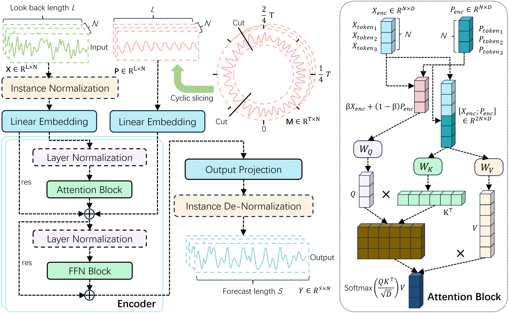
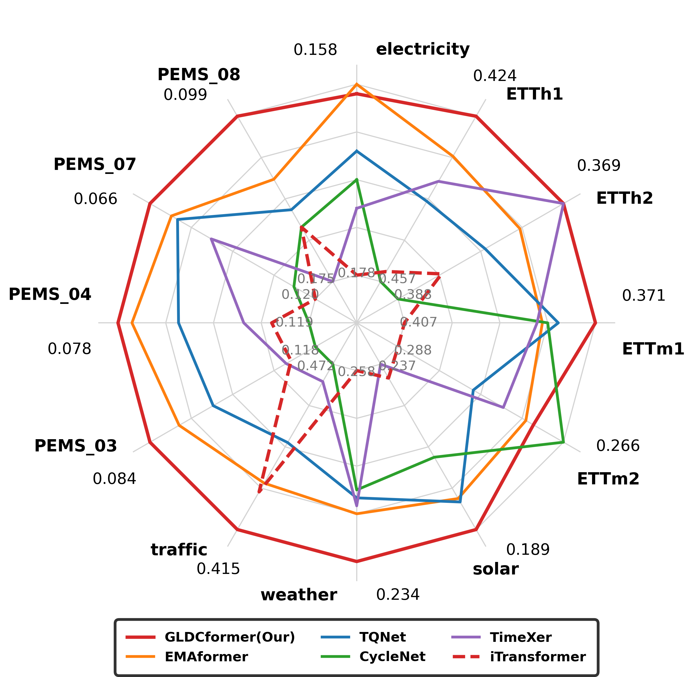

# GLDCformer: Multivariate Time Series Forecasting via Global and Local Dual Context

> **Official Implementation** of the paper: *"GLDCformer: Multivariate Time Series Forecasting via Global and Local Dual Context"*

## 📋 Overview

**GLDCformer** is a novel Transformer-based architecture for multivariate time series forecasting (MTSF). It introduces the **Global and Local Dual Context (GLDC)** technique to achieve deep synergistic modeling between:
- **Global Periodic Context (GPC)**: Stable periodic patterns as reference benchmarks
- **Local Evolutionary Context (LEC)**: Residual components and instantaneous observation data

Unlike previous methods that isolate these two contexts, GLDCformer enables local dynamics to perceive their real-time temporal position within the global cycle, effectively eliminating "perceptual blind spots" and filtering out spurious correlations in high-noise environments.

### Key Features

- 🏆 **State-of-the-art performance** on 12 real-world benchmark datasets
- 🔄 **Cross-architecture portability**: GLDC technique works on both Transformer and linear models
- ⚡ **High efficiency**: Optimal balance between accuracy and computational cost
- 🎯 **Robustness**: Stable performance across different random initializations

---

## 🏗️ Architecture

<div align="center">

<p><b>Figure 1:</b> Overview of the GLDCformer framework. Left: model operation flowchart. Right: GLDC-enhanced attention mechanism design.</p>
</div>

### Core Components

1. **GLDC-enhanced Attention Mechanism**
   - Reconstructs the retrieval space by concatenating LEC and GPC representations
   - Query: Weighted fusion of local and global contexts
   - Key/Value: Extended composite context
   - Expands token scale from N to 2N while maintaining N  D output dimension

2. **SwiGLU-based Feed-Forward Network**
   - Replaces traditional FFN with dual-branch interaction mechanism

3. **Inverted Embedding Paradigm**
   - Maps the full sequence of each variable into a token (following iTransformer)
   - Enables explicit modeling of inter-variable correlations

---

## 📊 Main Results

### Performance Radar (Average MSE across 4 prediction lengths)

<div align="center">

<p><b>Figure 2:</b> Performance comparison across 12 datasets. GLDCformer (red) achieves the most balanced and leading performance.</p>
</div>


---

## 🔬 Ablation Studies

### Component Contribution Analysis

| Model | Electricity (avg MSE/MAE) | PEMS03 (avg MSE/MAE) | PEMS04 (avg MSE/MAE) | PEMS07 (avg MSE/MAE) | PEMS08 (avg MSE/MAE) |
|-------|--------------------------|---------------------|---------------------|---------------------|---------------------|
| **GLDCformer (Ours)** | **0.159 / 0.254** | **0.084 / 0.187** | **0.078 / 0.179** | **0.066 / 0.158** | **0.099 / 0.183** |
| w/o GLDC | 0.173 / 0.265 | 0.103 / 0.211 | 0.106 / 0.212 | 0.082 / 0.177 | 0.129 / 0.214 |
| w/o FFN | 0.169 / 0.263 | 0.089 / 0.192 | 0.082 / 0.186 | 0.069 / 0.163 | 0.104 / 0.188 |
| w/o Both (Base) | 0.179 / 0.270 | 0.106 / 0.215 | 0.107 / 0.214 | 0.088 / 0.188 | 0.132 / 0.219 |
| w/ GLDC DLinear | 0.165 / 0.263 | 0.101 / 0.205 | 0.100 / 0.208 | 0.094 / 0.191 | 0.127 / 0.217 |
| w/ GLDC CycleNet | 0.168 / 0.259 | 0.118 / 0.226 | 0.119 / 0.232 | 0.113 / 0.214 | 0.150 / 0.246 |

**Key Insights**:
- GLDC technique provides **fundamental architectural improvement** (eliminating perceptual blind spots)
- SwiGLU FFN provides **representation-level enhancement**
- GLDC technique is **universally applicable**: Significant improvements even on linear models (DLinear, CycleNet)

---

## 🚀 Quick Start

## Environment Setup

You can set up the environment using either of the following two methods:

### Method A: Clone the Conda Environment (Recommended for exact reproduction)
This will create a new environment named `GLDCformer` with all exact dependencies.

```bash
# Create environment from the provided .yml file
conda env create -f environment.yml

# Activate the environment
conda activate GLDCformer
```

### Method B: Manual Installation via Pip
If you prefer to use your existing environment or are on a different OS:

```bash
# Create a fresh environment (optional)
conda create -n GLDCformer python=3.8
conda activate GLDCformer

# Install dependencies
pip install -r requirements.txt
```

### Requirements File

```
einops==0.8.1
joblib==1.4.2
scikit-learn==1.3.2
scipy==1.10.1
thop==0.1.1-2209072238
threadpoolctl==3.5.0
torchaudio==2.4.0
torchvision==0.19.0
```

---

## 📁 Project Structure

```
GLDCformer/
├── data_provider/          # Data loading and preprocessing
│   ├── data_loader.py
│   └── data_factory.py
├── experiments/            # Experiment configurations and logs
├── layers/                 # Core model components
├── model/                  # Model architectures
│   ├── GLDCformer.py       # Main GLDCformer model
│   └── GLDCDLinear.py      # GLDC-enhanced linear models
├── scripts/                # Training scripts
│   ├── Ablation/           # Ablation study scripts
│   └── GLDCformer/         # Main experiment scripts
│       ├── electricity.sh
│       ├── etth1.sh
│       ├── etth2.sh
│       ├── ettm1.sh
│       ├── ettm2.sh
│       ├── pems03.sh
│       ├── pems04.sh
│       ├── pems07.sh
│       ├── pems08.sh
│       ├── solar.sh
│       ├── traffic.sh
│       └── weather.sh
├── utils/                  # Utility functions
├── environment.yml
├── requirement.txt
├── run.py                  # Main entry point
└── README.md
```

---

## 🎯 Running Experiments

### 1. Long-term Forecasting (Main Results)

All experiments use fixed look-back window $L=96$ and prediction lengths $S \in \{96, 192, 336, 720\}$ (for non-PEMS datasets) or $S \in \{12, 24, 48, 96\}$ (for PEMS datasets).


```bash
# ETTh1
bash scripts/GLDCformer/etth1.sh

# ETTh2
bash scripts/GLDCformer/etth2.sh

# ETTm1
bash scripts/GLDCformer/ettm1.sh

# ETTm2
bash scripts/GLDCformer/ettm2.sh

# PEMS03
bash scripts/GLDCformer/pems03.sh

# PEMS04
bash scripts/GLDCformer/pems04.sh

# PEMS07
bash scripts/GLDCformer/pems07.sh

# PEMS08
bash scripts/GLDCformer/pems08.sh

# Solar
bash scripts/GLDCformer/solar.sh

# Weather
bash scripts/GLDCformer/weather.sh

# Traffic
bash scripts/GLDCformer/traffic.sh
```

### 2. Ablation Studies

```bash
# Run all ablation experiments
bash scripts/Ablation/All_Electricity.sh
bash scripts/Ablation/All_PEMS03.sh
bash scripts/Ablation/All_PEMS04.sh
bash scripts/Ablation/All_PEMS07.sh
bash scripts/Ablation/All_PEMS08.sh
bash scripts/Ablation/CycleNet_Electricity.sh
bash scripts/Ablation/CycleNet_PEMS03.sh
bash scripts/Ablation/CycleNet_PEMS04.sh
bash scripts/Ablation/CycleNet_PEMS07.sh
bash scripts/Ablation/CycleNet_PEMS08.sh
bash scripts/Ablation/DLinear_Electricity.sh
bash scripts/Ablation/DLinear_PEMS03.sh
bash scripts/Ablation/DLinear_PEMS04.sh
bash scripts/Ablation/DLinear_PEMS07.sh
bash scripts/Ablation/DLinear_PEMS08.sh
bash scripts/Ablation/FFN_Electricity.sh
bash scripts/Ablation/FFN_PEMS03.sh
bash scripts/Ablation/FFN_PEMS04.sh
bash scripts/Ablation/FFN_PEMS07.sh
bash scripts/Ablation/FFN_PEMS08.sh
bash scripts/Ablation/GLDC_Electricity.sh
bash scripts/Ablation/GLDC_PEMS03.sh
bash scripts/Ablation/GLDC_PEMS04.sh
bash scripts/Ablation/GLDC_PEMS07.sh
bash scripts/Ablation/GLDC_PEMS08.sh
```
